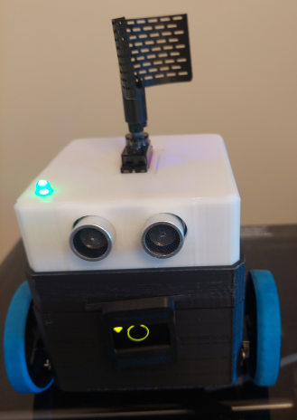
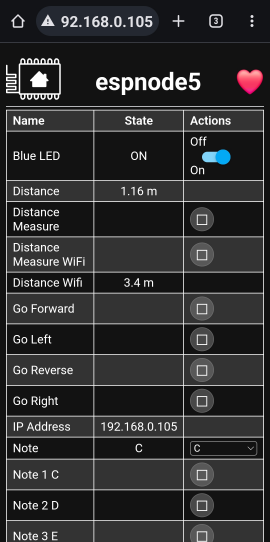

Servo Robot
===========
by Phil Pownall

Acknowledgments
---------------

Many thanks to the huge number of dedicated Home Assistant Community members who found many of these code solutions.  This example collects all the things required for a robot together in one place.

Description
-----------

This cute and easy-to-assemble robot consists of an ESP32 module, an expansion board, a USB battery pack, and two 360-degree servo motors.  No soldering is required (unless you want to make all the wires as short as possible).

Servo Motors provide an alternative to a Robot which uses L298N motor speed controllers and TT motors from RC cars.  This robot uses cheap and readily available SG90 or MG90 360-degree servo motors.

An ESP32 expansion board and a USB power pack have enough power to supply the ESP32 module, the servo motors, and some sensors and LED's.  No PWM controller board is required.

The USB power pack is prevented from auto-shutdown by using a 3rd servo motor rotating a *thing* (antenna) periodically.  The robot uses just one output of the USB battery pack for the expansion board: you can add an ESP-CAM using the second output.

The code is entirely contained in ESPHome using 500 lines of yaml.

The ESP32 provides a distance-from-the-router measurement feature using the onboard WiFi; an HC-SR04 Ultrasonic sensor provides a presence detection and short-range measurement feature.

The Robot chassis is a modified (slightly enlarged) 3D-printed enclosure based on the Otto Robot.

### Ingredients
- a $5 ESP32 module e.g. from [AliExpress](http://www.aliexpress.com)
- a $4 ESP32 Expansion board, like this one from [AliExpress](https://www.aliexpress.com/item/1005006176546785.html)
- two $4 360-degree metal gear MG90S servo motors, like these from [AliExpress](https://www.aliexpress.com/item/1005005672961991.html)
- an HC-SR04 Ultrasonic distance sensor
- a passive buzzer for audio feedback and tunes
- a $2 SSD1306 128x64 OLED display
- a 3D-printed enclosure and wheels like the [Otto robot](http://www.ottodiy.com/)
- a power supply, e.g. a 10,000mAh USB battery pack, like this small square one from [Amazon](https://www.amazon.ca/dp/B09MQHN2ZH?ref=ppx_yo2ov_dt_b_product_details&th=1)
- female-female hookup wires and a short USB cable

For a total bill-of-materials cost of less than $20 plus about $20 for a USB battery pack if you don't have one just lying around...

### Optional ingredients
- a 3D-printed caster shell with a marble inserted for a third wheel [Thingiverse](https://www.thingiverse.com/thing:8959)
- a Green LED + 220-ohm resistor
- a third 360-degree servo motor plus a 3D-printed antenna - like the [R2D2 Life Scanner antenna](https://www.thingiverse.com/thing:2834262/files)
- a $7 ESP-CAM camera module for First-Person Viewing capability (use a regular 180-degree servo for servo 3 and mount the ESP-CAM on top of the robot)
- elastic bands from grocery store Broccoli or Asparagus to use as tires on the Otto robot wheels (they fit perfectly!)

This recipe documents how to build an ESP32 module-based robot with control from an ESPHome web page or from a Home Assistant Dashboard.  With a separate ESPHome voice peripheral, voice control capability can be provided.  A 10,000 mAh USB battery pack will keep the robot alive for 5+ days, and it all fits inside the (slightly enlarged) 3D-printed Otto  robot chassis.

### ESP32 Expansion Board

The advantage of using an expansion board is that it provides a large number of pins to connect to motors and sensors.  For a servo motor, the 3-pin connector can be placed immediately adjacent to the GPIO pin that controls the servo signal input.  The voltage jumper on the expansion board is in the 5V position so that the *V* row on the expansion board is at 5V.  The board provides the capacity to add many sensors and components: e.g. an Ultrasonic distance, LED's, passive buzzers, and a display - limited only by the number of available pins on the ESP32 module and the capacity of the USB power supply.

Assembly instructions
=====================

After you have 3D-printed the 3 robot chassis components (Base, Waist, and Top), proceed to assembling the robot as follows:

1. Attach the 2 wheel servos to the Otto Base with the wires inside.  The motors are best mounted from the outside, but you can mount them from the inside if you are really good with fiddly small screws.

2. Place the USB power pack on top of the motors in the Otto base, with the USB connectors at the back of the base, and route the servo wires around the corners of the power pack.

3. Add the Otto Waist to the Otto Base by squeezing the sides carefully.  Insert the ESP32 module into the expansion board.  Don't forget to place the jumper on the expansion board to the 5V position so that the *V* row adjacent to the ESP32 pins is at 5V.  Place the Expansion board on top of the USB battery pack.

4. Attach the servo wires to the expansion board.  The Servo 1 3-wire connector (robot left wheel) goes onto GPIO19.  The Servo 2 3-wire connector goes on to GPIO21 - these pins are adjacent.  Attach the Servo 3 3-wire connector on to GPIO18.  Be careful not to reverse the connectors - the wire colours should match the colour of the rows on the expansion board - Black is *G* (GND), Red is *V* (5V), *S* is yellow (signal).

5. Attach the passive speaker *+* to *S* (signal) on GPIO23.  Attach the other leg to the *G* (GND) on GPIO23.

6. Attach the SSD1306 display data wire SDA to *S* on GPIO26 and the display clock wire SCL to *S* on GPIO25.  Attach the VDD wire to the *V* pin on GPIO25 or GPIO26, and the GND wire to the *G* pin on GPIO25 or GPIO26.  Place the display on the slot in the front of the Otto Waist.  Optionally, you could 3D-print a small case for the display and glue it to the front of the Otto Waist.

7. Attach the HC-SR04 ultrasonic TRIG wire to *S* on GPIO32 and the ECHO wire to *S* on GPIO35.  Attach the VCC wire to *V* and the GND wire to *G* on GPIO32 or GPIO35.

8. Trim the wires of a 220-ohm resistor to fit into the hookup wire terminals (to avoid shorts).  Attach one end of the 220-ohm resistor wire to *S* on GPIO35 and the other end to the long leg (Anode) of the Green LED.  Attach the other leg (Cathode) wire of the Green LED to the *G* pin on GPIO35.

9. Insert the ultrasonic sensor into the front holes in the Otto Top, and the Green LED into the corner hole in the Otto Top.  Attach Servo 3 to the under side of the Otto Top with two screws - using the under side makes it easier to disassemble the robot, and provides a sleek look to the antenna. Attach the Otto Top to the Otto Waist by squeezing the sides carefully.

10. Attach the small end of the USB cable to the expansion board.  Attach the large end of the USB cable to one output of the USB power pack.  Press the Power button on the side of the USB power pack, and enjoy!

